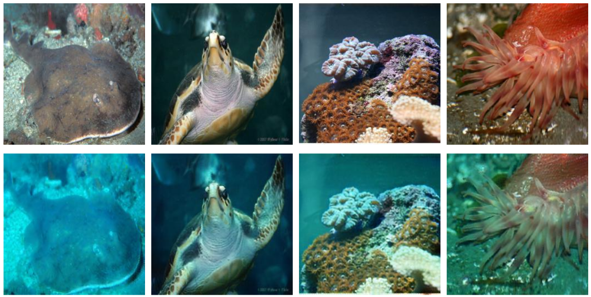
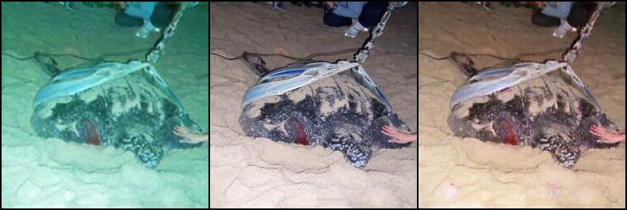
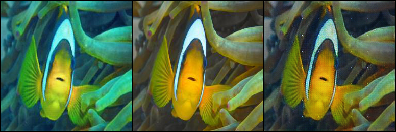
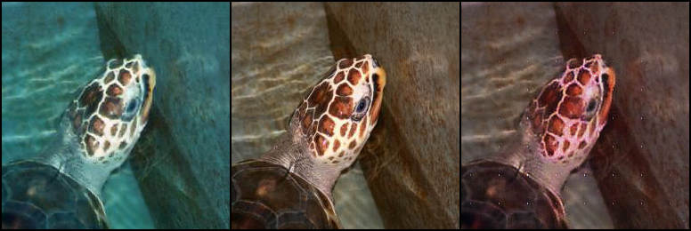

# Why do we need to Enhance UnderWater Imagery?

Autonomous underwater vehicles (AUVs) depend on various sensors for decision-making among which vision based are an
attractive sensing modality. But the visual data needs to be enhanced as the color red attenuates rapidly and the images
become bluish while small differences in its altitude to the sea-floor also affect the brightness of the images also
factors such as refraction and absorption, suspended particles in the water, and color distortion results in a noisy and
distorted visual data.

# Approach

To tackle this Pix2Pix GANs have been used to restore images. It's a Conditional Adversarial Network which performs
image to image translation by translating an image from any arbitrary domain X to another arbitrary domain Y. By letting
X be a set of distorted underwater images and Y be a set of undistorted underwater images, we can generate an image that
is the enhanced version of the given underwater image.

# Dataset Used

Dataset can be downloaded [here](https://drive.google.com/open?id=1LOM-2A1BSLaFjCY2EEK3DA2Lo37rNw-7) (428MB)

For more information on the dataset refer:

- https://ieeexplore.ieee.org/document/8460552
- http://irvlab.cs.umn.edu/enhancing-underwater-imagery-using-gans

## Preview:

First row consists of ground truth that we want, second row consists of visual data as seen underwater.


# PreTrained Model

- Extract the zip file and put the pth.tar files in the directory with all the python files. Make sure to
  set ```LOAD_MODEL=True``` in the ```config.py``` file.

- Link to the zip file containing pretrained weights of generator and
  discriminator [Mega Link](https://mega.nz/file/uiwjDS5b#OJ2sezjr_-Q4zm5qkF2JBOHZQCGZ63ljBV-xFfd0-Xk) (586.1MB)

# Training

- The code is capable of running on single machine multiple GPU system.
- If GPU is being used then in config.py:
    - Set the ```DEVICE``` as the main device you want to use. By default ```cuda:5```.
    - Set the ```DEVICE_IDs``` as the list of GPU ids you want to use keep the first index of this list same as the one
      in ```DEVICE```.
- If CPU is being used then in config.py:
    - Set the ```DEVICE``` as ```"cpu"```
    - Set the ```DEVICE_IDs``` as ```["cpu"]```.
- Edit other parameters in ```config.py``` to match the setup you want to use and run ```train.py```.

# Results

| 1st column: Underwater Image / 2nd column: Ground Truth / 3rd column: Generated Image |
|:-------------------------------------------------------------------------------------:|
|                                                                     |
|                                                                   |
|                                                                    |

```
@misc{isola2018imagetoimage,
      title={Image-to-Image Translation with Conditional Adversarial Networks, 
      author={Phillip Isola and Jun-Yan Zhu and Tinghui Zhou and Alexei A. Efros},
      year={2018},
      eprint={1611.07004},
      archivePrefix={arXiv},
      primaryClass={cs.CV}
}

@inproceedings{Fabbri2018ICRA, 
      author = {Cameron Fabbri and Md Jahidul Islam  and Junaed Sattar},
      title = {{Enhancing Underwater Imagery using Generative Adversarial Networks}},
      booktitle = {Proceedings of the {IEEE International Conference on Robotics and Automation (ICRA)}, to appear},
      year = {2018},
      address = {Brisbane, Queensland, Australia},
      month = {May}
}
```